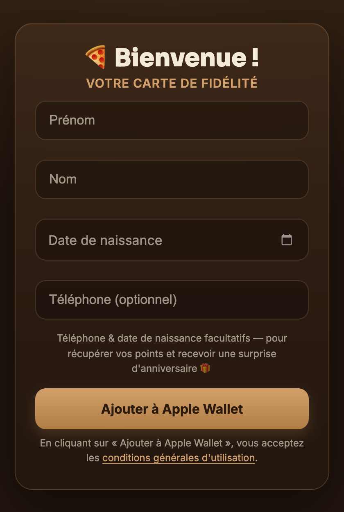
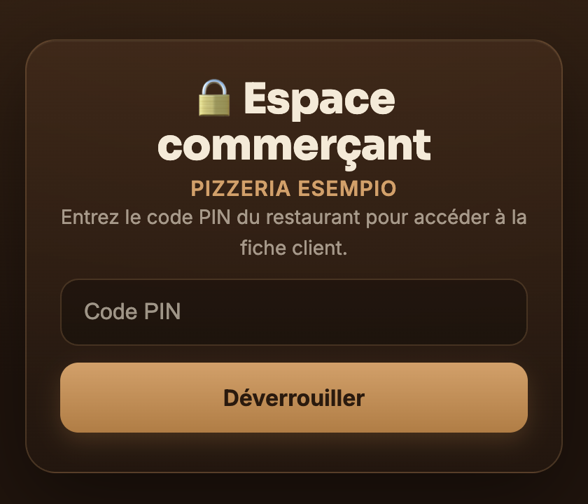

# wallet-loyalty

An Apple Wallet loyalty card for a small restaurant: the customer fills one form, gets a signed `.pkpass` unique to them, and every stamp the merchant adds shows up on their lock screen — no app to install, no account to create.

<p align="center">
  
  
</p>

## Why I built it

I built this for a real pizzeria that was still using paper punch cards, which customers lost and the staff could not count. The interesting constraint was that the customer must not have to install anything: Apple Wallet is already on the phone, and a pass can update itself over the network. So the whole product is one signed file per customer, plus a server that knows how to re-sign and re-push it.

This repository is a cleaned copy of that work. The client's name, address, branding and business details are removed, and the pass artwork is replaced by generated placeholders.

## How a pass actually works

A `.pkpass` is a zip of images, a `pass.json`, a `manifest.json` holding the SHA-1 of every file, and a `signature` — a PKCS#7 detached signature over the manifest, made with an Apple Pass Type ID certificate. Apple refuses an unsigned pass, so signing is the whole game.

Two subsystems share one signing identity:

- **`pass-sample.pass/` + `sign.sh`** — the hand-built card. One static pass, signed locally with `openssl smime`. This is the prototyping path: change the JSON or the artwork, re-run the script, drop the file on a phone.
- **The Next.js app** — the real product. It generates, signs and serves a *different* pass per customer on the fly, backed by Postgres, and pushes updates to the phone.

Once a pass is on the phone, iOS registers it with the web service declared inside it (`/api/wallet/v1/…`). When a stamp is added the server sends an APNs push to every registered device, iOS calls back for the new pass, and the card changes in the customer's Wallet without anyone opening anything. That round trip is the part that took the longest to get right.

## Stack

- **Next.js 15** (App Router) on Vercel — pages, API routes and the Wallet web service in one deployment
- **Supabase Postgres** — members, cards, events, settings. Accessed only server-side with the service-role key; there is no public row-level policy at all.
- **passkit-generator** for building and signing the pass, **sharp** for rendering the stamp strip image server-side
- **APNs** over the Wallet push topic, using the same Pass Type ID certificate
- The merchant dashboard is PIN-gated, with brute-force protection on the PIN

Notable pieces:

- `lib/cardAuth.ts` — a per-card secret token instead of the guessable serial number, so knowing a serial does not let you stamp someone else's card
- `lib/loyalty.ts` — points are applied atomically, so a double scan cannot double-stamp
- `lib/stampStrip.ts` — the stamp row is drawn server-side into the pass strip image, so the card *looks* like a punch card
- `lib/reviews.ts` + `app/api/cron/review-nudge` — an automated Google review ask roughly seventeen minutes after a scan, with a tracked link and deduplication, and the ask is not consumed if the push fails
- `lib/birthday.ts` — an optional birthday field driving a yearly notification

## How to run

```bash
npm install
cp .env.example .env.local   # then fill it in
npm run dev
```

You need a Supabase project (run the SQL in `supabase-schema.sql`, then the `MIGRATION-*.sql` files in order) and an Apple Pass Type ID certificate. Without the certificate the app runs but cannot produce a pass — Apple has no unsigned mode.

To split the certificate into the two PEMs the app expects:

```bash
openssl pkcs12 -in Certificates.p12 -clcerts -nokeys -out certs/signerCert.pem -legacy
openssl pkcs12 -in Certificates.p12 -nocerts -nodes -out certs/signerKey.pem -legacy
```

`certs/`, `*.pem` and `*.p12` are gitignored.

## Status

Working, and used in production by the restaurant it was built for:

- Sign-up → unique signed pass → added to Wallet
- Scan → stamp → APNs push → the card updates on the phone
- Merchant dashboard: members, per-member detail, stats, settings, broadcast notification, CSV export
- Reward at ten stamps, then the counter resets
- Review nudge and birthday notification

Not done:

- No test suite. `TEST-CHECKLIST.md` is a manual checklist, which is what this was actually verified against.
- Android has no Wallet equivalent here — Google Wallet passes are a different format and are not implemented
- The specs in this repository (`MVP.md`, `DASHBOARD-SPEC.md`, `REVIEWS-FEATURE.md`, `TEST-CHECKLIST.md`) are working documents in French, kept because they show the reasoning, not because they are polished
- The artwork in `pass-model/` and `pass-sample.pass/` is placeholder, generated flat colour. Real cards need real assets.

## License

MIT — see [LICENSE](LICENSE).
